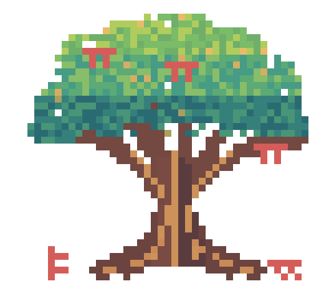

# Welcome card

A new session should make it easy to check where Pi landed and what it has available. The card shows the tree alongside the workspace, branch, sandbox status when available, model, thinking level, context files, skills, prompts, and tools. It picks a large, small, or tiny tree to fit the terminal.

An empty session gets one card automatically. Run `/eleith welcome` or `/eleith welcome show` to add another at the size Pi chooses, or use `/eleith welcome large|small|tiny` to ask for a particular size. `/eleith welcome auto` uses automatic sizing again, and a requested size falls back if it cannot fit. Resuming a session or running `/reload` will not add another startup card on its own.

The image above uses the large `TREE` and `PALETTE` from [`tree-data.ts`](tree-data.ts). If the tree changes, update `large-tree.svg` too.
